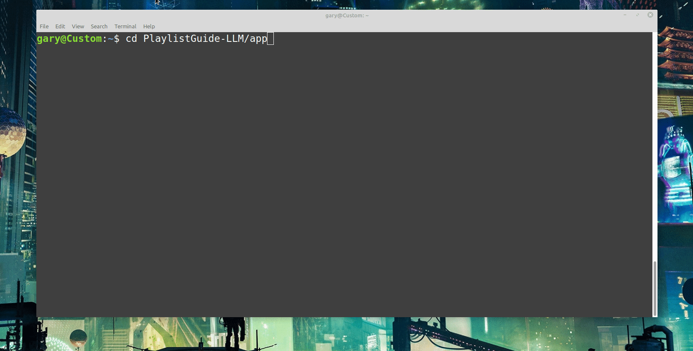
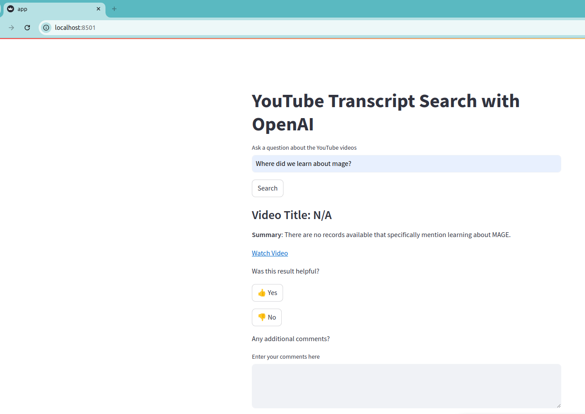
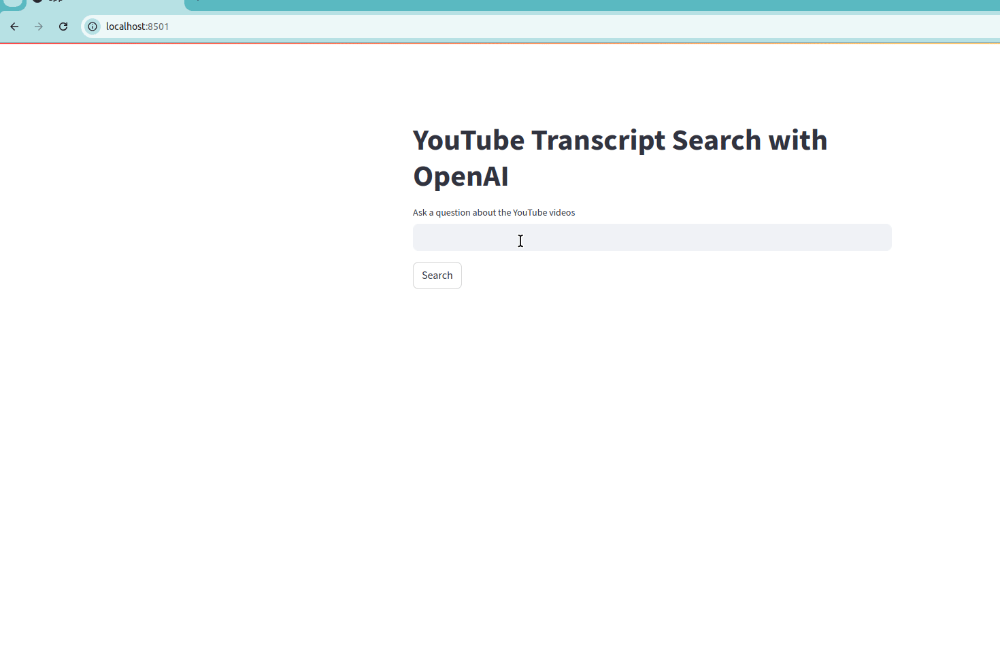

# PlaylistGuide-LLM
An LLM Chatbot which assists the user with answering questions about and finding locations of content in a Youtube Playlist

## Problem Statement
Playlists can be quite long and finding the exact location of content can be tedious. This project aims to assist users with finding the locations (video and timestamp) of specific content and be able to answer questions about the content in a given playlist.

## Project Overview
There are three main directories of interest in this project
* <b>app</b> - This is the directory where the transcript RAG/LLM Application is
* <b>transcript_pulls</b> - This directory contains research for several ways in which the transcripts were attempted to be pulled
* <b>evaluation</b> - This directory contains the generation of a ground truth data set as well as Hit Rate and MRR Evaluations


## Walkthrough Video
TODO

# Steps to reproduce
Optional - log into a GCP account and search for YouTube</br>
</br>

You may need to Enable the API. Once enabled you can then click Manage</br>
</br>

Click the credentials button on the left and then + Create Credentials</br>
</br>

You do not have to pull the transcripts as an up to date pickle file should be present in the PlaylistGuide-LLM/app/data directory.
If you do wish to pull fresh data, you will simply need to delete the processed.txt file (this keeps track of video IDs already pulled so they are not pulled on subsequent runs) and run pull_transcripts_metadata.py<br>

## Create OpenAI API Key and add to .env file
Setup an OpenAI API Account<br>
Go to: https://platform.openai.com/settings/profile?tab=api-keys<br>
Generate an API Key<br>
</br>
and add it to your .env file


## Create a .env File
### PostgreSQL
POSTGRES_USER=postgres_user<br>
POSTGRES_PASSWORD=postgres_password<br>
POSTGRES_DB=user_feedback<br>

### Elasticsearch
ELASTIC_URL_LOCAL=http://localhost:9200<br>
ELASTIC_URL=http://elasticsearch:9200<br>
ELASTIC_PORT=9200<br>

### pgAdmin
PGADMIN_DEFAULT_EMAIL=admin@example.com<br>
PGADMIN_DEFAULT_PASSWORD=admin_password<br>

### OpenAI API Key
OPENAI_API_KEY=your_openai_api_key<br>

### YouTube API Key
YouTube_API_KEY=your_youtube_api_key


## Clone the respository locally
```git clone https://github.com/MichaelShoemaker/PlaylistGuide-LLM.git```

change to the streamlit app directory<br>
```cd PlayListGuide-LLM/app```

if you are on Linux you should be able to just run<br>
```make up```
</br>
or if you are on another system the equivelant of<br>
```docker compose up --build```

<b>Note: It will take some time on the first run. Probably 15-30 minutes depending on your system.</b>

## Transcript Search
You should then be able to navigate to http://localhost:8501/ and search the transcripts
</br>

If you get a message with Video Title: N/A it most likely means Elasticsearch is not loaded yet. Give it several more minutes.<br>
You can then try again.<br>

</br>


# Other directories of note:

* transcript_pulls - several different ways in which I tested pulling the transcripts
    - Within this directory under metadata_transcripts you can see the steps which were taken to generate ground_truth and evaluate Elasticsearch
* research - simply a "dumping ground" of other testing scripts and expiriments without structure or organization. This may be removed.
